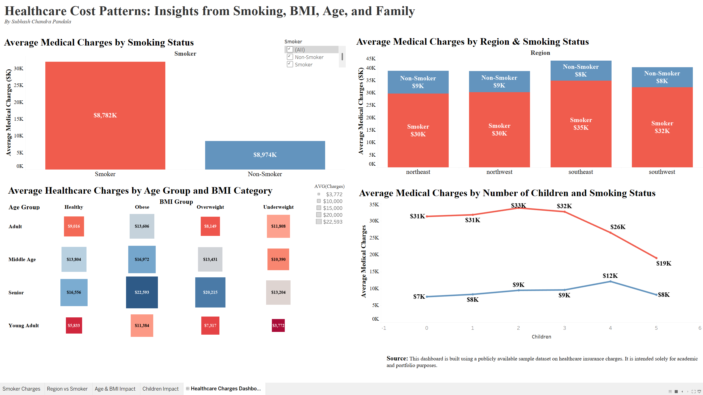

# Healthcare Claims Analysis Dashboard

This is a complete end-to-end data analysis project focused on understanding the factors that influence healthcare insurance charges. The project starts with data cleaning and analysis using **SQL in Google BigQuery**, and ends with an interactive **Tableau dashboard**.

---

## Project Structure

- `SQL-BigQuery`: SQL queries written and executed in Google BigQuery for data exploration.
- `Tableau Dashboard`: Interactive dashboard built using Tableau to visualize key insights.
- `dashboard_preview.png`: Snapshot of the final dashboard.

---

## SQL Analysis (BigQuery)

Before building visualizations, the dataset was analyzed and aggregated using SQL in Google BigQuery.

**Key queries performed:**
- Average charges grouped by **smoker status**
- Average charges by **region**
- Cross-segmentation of **age and BMI** groups
- Charges trend based on **number of children**

The cleaned data was then used as a source for Tableau.

---

## Tableau Dashboard

The dashboard was designed to answer 4 key business questions:

1. **Smoker vs Non-Smoker**: How does smoking status affect average healthcare charges?
2. **Region-wise Analysis**: Do healthcare costs vary by region and smoker type?
3. **Age & BMI Impact**: How do different age and BMI categories influence costs?
4. **Children Factor**: Does the number of children correlate with medical charges?

Each visualization is filterable using the **Smoker Status** dropdown, providing interactivity.

---

## Tools Used

- **Google BigQuery** – SQL-based data analysis
- **Tableau Desktop** – Visualization and dashboard creation
- **Public Healthcare Dataset** – Insurance data containing demographic and cost-related information

---

## Dashboard Preview

---

## Author

**Subhash Chandra Pandala**  
This project is part of my Data Analyst portfolio and was completed independently to demonstrate real-world problem-solving, dashboard design, and cloud data integration.

