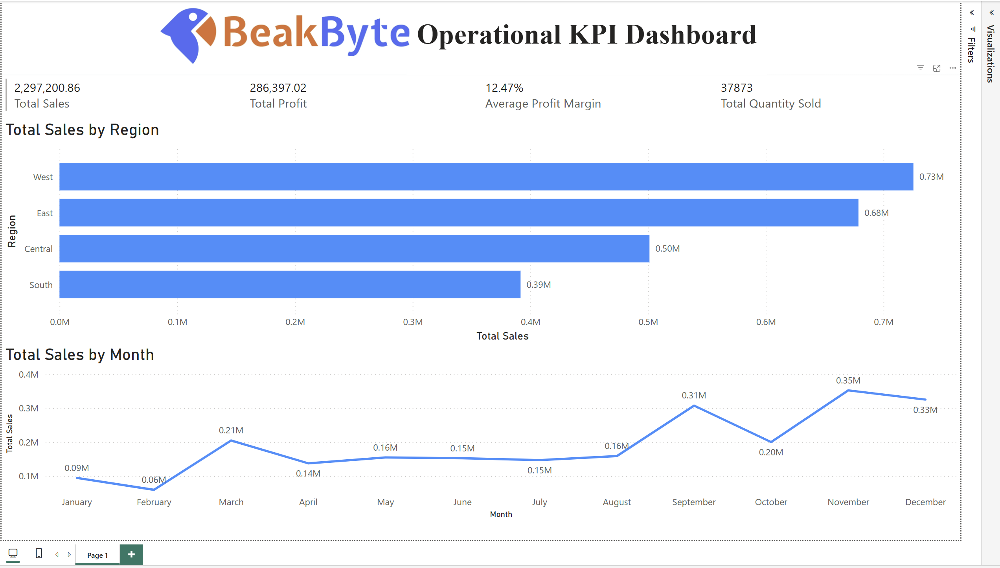

# Operational KPI Dashboard – Power BI

## Overview  
This portfolio project demonstrates end-to-end business intelligence design using Power BI. It simulates the operational performance of a fictional retail company and focuses on stakeholder-facing KPI dashboards for executive decision-making.

---

## Objectives  
- Visualize performance across **sales**, **profit**, and **quantity sold**  
- Track **regional performance** and **monthly sales trends**  
- Design a clean, responsive layout optimized for stakeholder consumption  

---

## Tools & Technologies  
- **Power BI Desktop**  
- **DAX** (calculated measures)  
- **Excel** (mock data source)  
- **UI Enhancements**: KPI cards, slicers, custom branding  

---

## Metrics Tracked  
- Total Sales  
- Total Profit  
- Average Profit Margin  
- Total Quantity Sold  
- Sales by Region (Bar Chart)  
- Monthly Sales Trends (Line Chart)

---

## Business Relevance  
This dashboard mirrors the kind of operational reporting commonly used by data analysts and BI teams across industries. Its structure, metric focus, and executive-ready design reflect real-world enterprise use cases.

---

## 🖼 Dashboard Preview  

---

## 📁 Files Included  
- `Operational-KPI-Dashboard.png` – Dashboard snapshot  
- `Operational_KPI_Dashboard.pbix` – Power BI project file   

---

## Key Highlights  
- Built dynamic DAX measures for profitability and sales KPIs  
- Applied slicers and trend visuals for interactive performance review  
- Emphasized clean, stakeholder-ready design for maximum usability  
- Showcased storytelling through data to support high-level decisions  

---

## Use Cases  
- Monthly sales reviews  
- Regional profit tracking  
- Operational health monitoring  
- Executive performance summaries  
