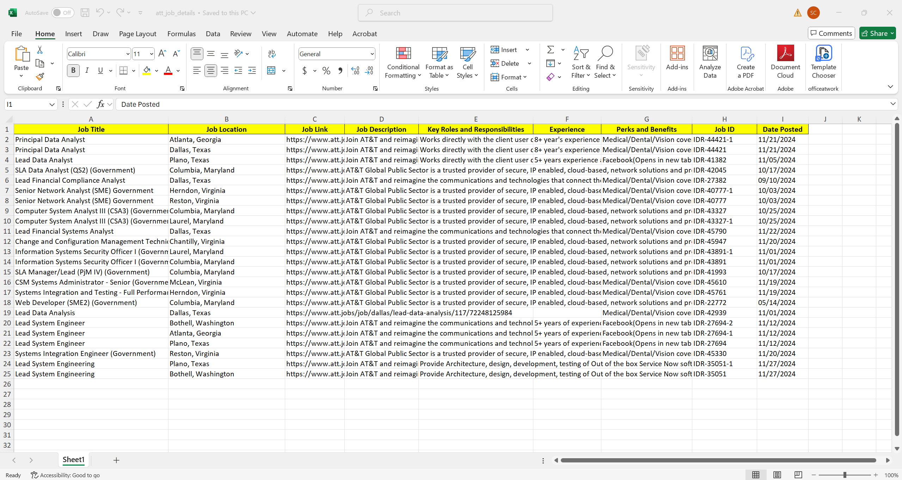

# Capstone Project – Analyst Job Listing Insights via Web Scraping
  
This project was built to analyze job listings across top enterprise companies in Dallas. The goal was to gather live job data from company career portals, understand role requirements, and identify trends in skills, qualifications, and expectations. I designed this workflow using Python and automated scraping techniques to simulate a real-world workforce analytics project.


---

### Preview Snapshot  
A structured Excel output from AT&T's career site, showing real-time job listings scraped via Python automation:



---

## Project Overview

I wrote custom Python scripts using Selenium and BeautifulSoup to scrape job descriptions from four companies — IBM, AT&T, Equinox, and Texas Instruments. Each script was tailored to the structure of the company’s job portal. The data was cleaned and structured into Excel files for further comparison and analysis.

This project gave me hands-on experience in dynamic web scraping, data cleaning, and creating structured outputs for insights.

---

## Objectives
- Collect live job postings for tech and analyst roles across 4 enterprise-level companies
- Extract key fields: job title, location, posted date, responsibilities, qualifications
- Standardize and organize the data for analysis in Excel
- Understand skill demand patterns and common expectations across firms

---

## Tools & Technologies
- Python (Selenium, BeautifulSoup, Pandas)
- Excel for storing final outputs
- Manual logic handling for DOM parsing
- ChromeDriver for browser automation

---

## Companies Covered
- **IBM**  
- **AT&T**  
- **Equinox**  
- **Texas Instruments**

---

### Project Structure

```text
Strategic-Job-Market-Analytics/
├── att.py                                # Web scraper for AT&T job listings
├── equinox.py                            # Web scraper for Equinox job listings
├── ibms.py                               # Web scraper for IBM job listings
├── tidi.py                               # Web scraper for Texas Instruments job listings
├── att_job_details.xlsx                  # Extracted data from AT&T
├── Equinox_job_details.xlsx              # Extracted data from Equinox
├── ibm_job_details.xlsx                  # Extracted data from IBM
├── Texas_instruments_job_details.xlsx    # Extracted data from Texas Instruments

Project Documentation:
├── Group Project Guideline.pdf           # Faculty-provided initial project guidelines
├── Planning.docx                         # Our internal project planning document
├── Implementation.docx                   # Step-by-step implementation breakdown
├── Report.docx                           # Final project report and insights

---

## Outcome

This project simulates real-world applications in job market analytics, using automation and structured reporting to explore evolving hiring trends. The approach mirrors internal workforce strategy projects found in analytics consulting and HR insights teams.


